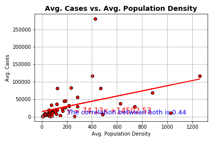
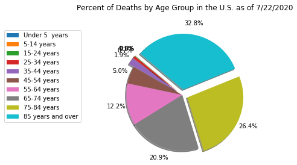
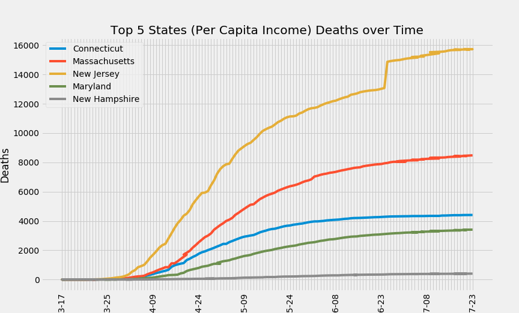
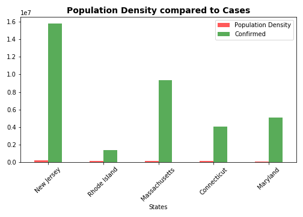
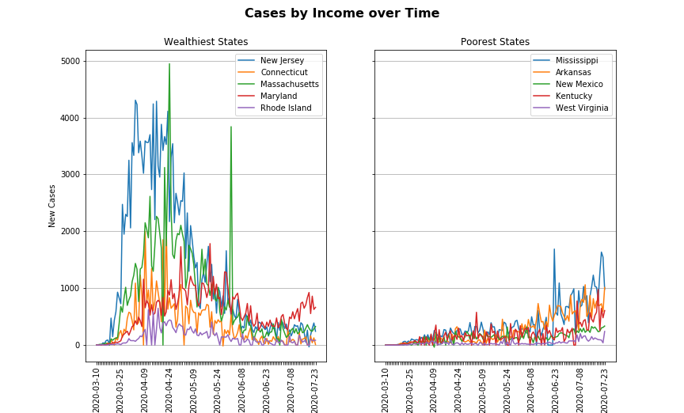
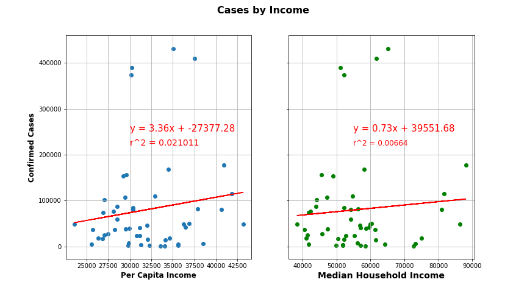
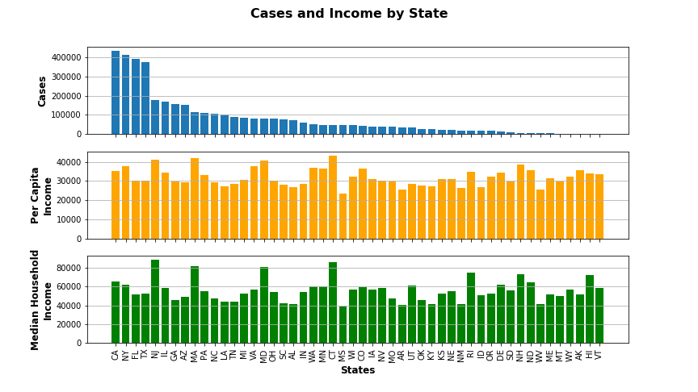
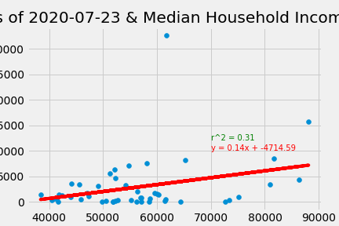
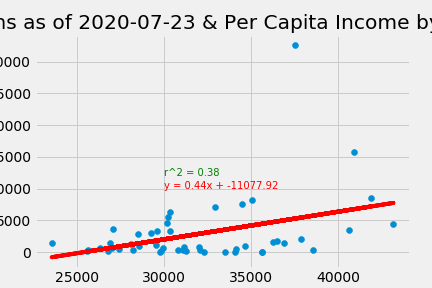

# Images
This folder is for outputting any images, like plots, that our python scripts generate.

* Average Cases vs. Average Population Density\

* Deaths By Age\

* Cases And Deaths\

* Cases By Population Density\

* Cases Vs Time\

* Income By State\

* Cases and Income by State\

* Deaths Per Median Income\

* Deaths Per Capita Income\

* Top 5 States per Capita Deaths\
