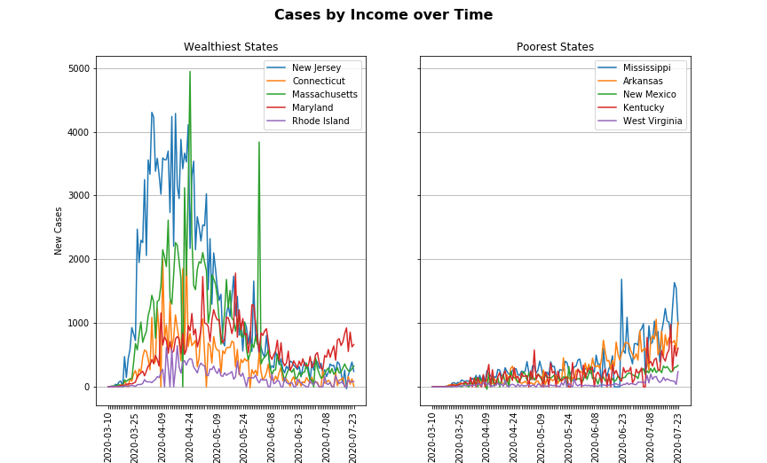

Python Version 3.76

RUN INSTRUCTIONS

# Step 1: Installation
To install, use 'pip' or 'easy_install'

```bash
$ pip install us
```
```bash
$ pip install uszipcode
```
```bash
$ pip install census
```
```bash
$ pip install ipynb
```
```bash
$ pip install matplotlib
```
```bash
$ pip install pandas
```
```bash
$ pip install numpy
```
```bash
$ pip install pprint
```
```bash
$ pip install scipy
```

# Step 2: Obtain required API Keys in config.py
* Required API Key census_key, from http://api.census.gov/data

# Step 3: Run the application
Clone the project to local computer/device

# Step 4: Execute programs in this order
List notebooks

* CensusData
* Deaths By Age\

* CasesAndDeaths
* Cases_PD
* Cases_PopDensity
* CasesVsWealth\

* AllByState
* IncomePopByState\

* Deaths_Median_Income_Scatter
* Deaths_Per_Cap_Scatter
* top_5_per_cap_deaths


# ETL Documentation
This file shows how we extracted, transformed, and loaded our data sources for plotting:
ETL-Documentation.docx

## Data source API's to explore
List our data source API's that we're exploring here.

From the project proposal:
* https://covid-api.com/api/reports
* https://www.census.gov/data
* https://rapidapi.com
* https://data.cdc.gov/nchs
* https://pypi.org
